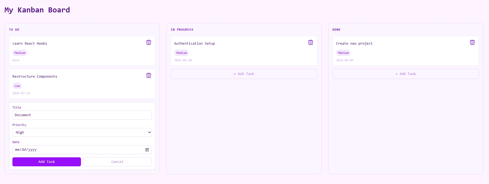

# Kanban Board

A drag-and-drop task management board built with React and TypeScript. Tasks can be created, moved between columns, and deleted.

## Live Link

[click here](https://icedpepperminttea.github.io/kanban-board/)

## Screenshots



## Features

- **Three-column layout** — To Do, In Progress, and Done
- **Drag and drop** — move tasks between columns or reorder within a column
- **Add tasks** — create tasks with a title, priority level, and due date
- **Delete tasks** — remove tasks with a single click
- **Priority labels** — High, Medium, and Low with color coding

## Tech Stack

- **React 19** — component architecture, useState, props, lifting state up
- **TypeScript** — type safety with interfaces and custom types
- **Tailwind CSS v4** — utility-first styling
- **@hello-pangea/dnd** — drag and drop
- **Vite** — build tool and dev server

## Getting Started

```bash
# clone the repo
git clone https://github.com/your-username/kanban-board.git

# navigate into the project
cd kanban-board

# install dependencies
npm install

# start the dev server
npm run dev
```

Then open `http://localhost:5173` in your browser.

## Project Structure

```
src/
├── components/
│   ├── Board.tsx        # renders the three columns
│   ├── Column.tsx       # renders tasks within a column
│   ├── TaskCard.tsx     # renders an individual task card
│   ├── AddTaskForm.tsx  # form to create a new task
│   └── DeleteTaskCard.tsx # delete button for a task
├── App.tsx              # state management and drag and drop logic
├── main.tsx             # entry point
└── index.css            # global styles
```

## Key Concepts Used

- **Component architecture** — UI broken into small reusable components
- **Props and lifting state up** — data flows down, functions flow up
- **Controlled inputs** — form fields connected to React state
- **Immutable state updates** — always copying state before updating
- **TypeScript types** — custom types for Task, Column, and BoardData
- **Drag and drop** — handling reorder within columns and cross-column moves

## What I Learned

This was my first React project. Building it taught me how React state works, how components communicate through props, and how to think about data flow in a UI application.

## Future Improvements

- Edit existing tasks
- Add a description section for each task
- Persist data with localStorage so tasks survive a page refresh
- Add a fourth column or custom column names
- User authentication with saved boards
